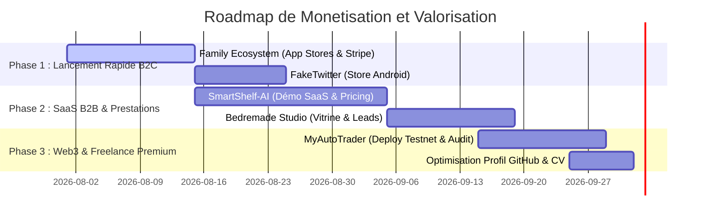

# Classement Stratégique des Projets & Roadmap d'Amélioration

---

## Executive Summary

Ce document établit une analyse approfondie et un classement par fort potentiel financier, pertinence technique et valeur marché de l'ensemble des **26 projets** du portefeuille GitHub (`github.com/mazounirayan`).

L'objectif est d'identifier les leviers d'action immédiats pour :
1. **Générer des revenus directs** (SaaS B2B, Micro-SaaS B2C, Vente de templates/APIs).
2. **Maximiser le TJM en Freelance / Prestation** (Showcases techniques haute valeur).
3. **Optimiser le profil professionnel** (CV, GitHub, entretiens techniques).

---

## 🏆 Tier List & Matrice de Potentiel Financial

```
+-------------------------------------------------------------------------+
| TIER S - PÉPITES COMMERCIALES & BUSINESS READY                          |
| • SMARTSHELF-AI (SaaS B2B Computer Vision / Retail Facing)              |
| • family-ecosystem (App Mobile B2C Freemium - 100% Code Complete)        |
| • Agrofrugal (DeepTech / Green AI / Edge SLM Diagnostics)               |
+-------------------------------------------------------------------------+
| TIER A - POTENTIEL COMMERCIAL ÉLEVÉ (AVEC MODIFICATIONS)                |
| • MyAutoTrader_Project (DApp Web3 / DeFi Automated Trading)             |
| • fakeTiwtter / FauxTwitte (App Mobile Créateurs de Contenu / Mockups)  |
| • bedremade (Vitrine Studio Software & Inscription Waitlist)            |
| • JarvisVibeCoding (Plateforme Automation AI / n8n Webhooks)            |
+-------------------------------------------------------------------------+
| TIER B - VALEUR FREELANCE & LEVIER PRESTATION (PORTFOLIO CLIENT)        |
| • KapsuleKorp (DevOps / Infrastructure as Code Ansible)                 |
| • tassili_airlines (Template E-Commerce Laravel / Billetrie PDF)        |
| • student-project-manager & pa-ecaf (EdTech / Backoffice Gestion)        |
| • BarkingGestionArchi (Architecture Microservices Event-Driven RabbitMQ)|
+-------------------------------------------------------------------------+
| TIER C - VALEUR TECHNIQUE CV (SANS POTENTIEL COMMERCIAL DIRECT)        |
| • cleanCodeFront (Architecture Hexagonale React/TypeScript)            |
| • InitiationAuxTraitementsDistribues (ETL PySpark Big Data & Grafana)   |
| • ML_5AL2 (Data Prep & Machine Learning Notebooks)                      |
+-------------------------------------------------------------------------+
| TIER D - ARCHIVES & FORKS SANS VALEUR COMMERCIALE (À ARCHIVER / NETTOYER)|
| • TrainingGame, React-RED, designPatternProjet, elMazUsine, fill-rouge,  |
|   projetJS, workProject-legacy, app-ideas, Forks d'équipe secondaires    |
+-------------------------------------------------------------------------+
```

---

## 🔍 Analyse Détaillée des Projets par Catégorie

---

### 🟢 1. TIER S : Pépites Commerciales & Business Ready

#### 1.1 `SMARTSHELF-AI` (A_Vitrine)
- **Contexte & Audit Technique** : Plateforme SaaS B2B d'optimisation de linaires pour la grande distribution ("Smart Facing"). Architecture microservices complète sous Python (FastAPI), détection d'objets YOLOv8, OCR, moteur d'optimisation sous contraintes (Google OR-Tools / PuLP), PostgreSQL, Redis, MinIO et dashboard web Next.js.
- **Potentiel Financier** : **TRÈS ÉLEVÉ (SaaS B2B / DeepTech Retail)**.
  - Modèle : Abonnement SaaS B2B mensuel par magasin / point de vente (ex: 199€ à 499€ / mois par supermarché).
  - Prestation de consulting / sur-mesure pour enseignes de retail.
- **Ce qu'il faut modifier / améliorer (Roadmap)** :
  1. **Finaliser le modèle de vision** : Entraîner YOLOv8 sur un dataset restreint de mini-étiquettes prix et produits tronqués.
  2. **Intégrer Stripe Billing** : Gérer la facturation multi-tenants et les quotas de scans.
  3. **Packaging Docker Cloud** : Fournir un manifeste Helm / Docker Compose prêt pour un déploiement Cloud (AWS ECS ou Hetzner).

#### 1.2 `family-ecosystem` (A_Vitrine)
- **Contexte & Audit Technique** : Application mobile cross-plateforme Flutter avec backend BaaS Supabase (PostgreSQL, RLS, Realtime, Triggers). Fonctionnalités : tâches ménagères gamifiées, système de récompenses/points, chat familial, routines "Magic Templates", 64/64 tests unitaires passés (100% Code Complete).
- **Potentiel Financier** : **ÉLEVÉ (Micro-SaaS B2C / Mobile App Freemium)**.
  - Modèle : App sur App Store / Google Play avec Freemium (Gratuit pour 1 famille/3 membres, Option Premium à 3,99€/mois ou 29,99€/an pour familles illimitées, historique et thèmes).
- **Ce qu'il faut modifier / améliorer (Roadmap)** :
  1. **Activer In-App Purchases / RevenueCat** : Intégrer les abonnements in-app.
  2. **Visuels Stores & Landing Page** : Créer les captures d'écran promotionnelles avec cadre smartphone.
  3. **Publication Google Play Store & Apple App Store**.

#### 1.3 `Agrofrugal` (Forks_Equipe)
- **Contexte & Audit Technique** : Solution IA Éco-responsable (Green AI) pour le diagnostic de maladies agricoles par SMS/Edge. Modèle DistilBERT quantifié INT8 (<15ms de latence, conteneur <150 Mo), FastAPI, Redis, suivi de l'empreinte carbone (CodeCarbon) et métriques Prometheus/Grafana.
- **Potentiel Financier** : **TRÈS ÉLEVÉ (B2B AgTech / Subventions & Consulting IA Éco-responsable)**.
  - Modèle : API B2B vendue aux coopératives agricoles ou gouvernements/ONG (API SMS/WhatsApp pour agriculteurs).
- **Ce qu'il faut modifier / améliorer (Roadmap)** :
  1. **Adapter l'API vers WhatsApp Business / Telegram Bot** (plus universel que le SMS brut).
  2. **Créer une démo web interactive (Gradio / Streamlit)** pour présenter le gain de vitesse et l'économie de carbone.

---

### 🟡 2. TIER A : Potentiel Commercial Élevé (Avec Modifications)

#### 2.1 `MyAutoTrader_Project` (A_Vitrine)
- **Contexte & Audit Technique** : Plateforme DApp Web3 de trading automatisé et de gestion de portefeuille crypto. Smart Contracts Solidity (Chainlink Oracles, OpenZeppelin), tests Hardhat, Frontend Next.js 15, Wagmi, Viem, RainbowKit, Recharts.
- **Potentiel Financier** : **ÉLEVÉ (DApp Crypto / Frais sur Transactions / Prestation Web3 Freelance à 600€-800€/jour)**.
- **Ce qu'il faut modifier / améliorer (Roadmap)** :
  1. **Implémenter une commission de protocole (Take Fee)** : Ajouter 0.1% de frais prélevés par le smart contract sur chaque arbitrage/rebalancement automatique.
  2. **Déploiement sur Testnet public (Arbitrum Sepolia / Base Sepolia)** pour avoir un lien de démo fonctionnel avec vrais jetons test.
  3. **Audit de sécurité interne (Slither / Echidna)** documenté.

#### 2.2 `fakeTiwtter` / `FauxTwitte` (C_A_Nettoyer)
- **Contexte & Audit Technique** : Application Flutter mobile permettant de générer des faux tweets, faux posts Instagram/TikTok et fausses conversations avec prévisualisation fidèle et exportation d'images.
- **Potentiel Financier** : **MODÉRÉ À ÉLEVÉ (App B2C pour Créateurs de Contenu / TikTokers / Storytellers)**.
  - Modèle : Application mobile avec filigrane sur la version gratuite, déblocage "No Watermark + Export 4K" pour 2,99€ unique ou 0,99€/mois.
- **Ce qu'il faut modifier / améliorer (Roadmap)** :
  1. **Mettre à jour l'UI vers les standards actuels de X/Twitter et Threads**.
  2. **Ajouter un module d'export vidéo / GIF animé** (très demandé sur TikTok).
  3. **Publier sur Google Play Store**.

#### 2.3 `bedremade` (C_A_Nettoyer)
- **Contexte & Audit Technique** : Site vitrine de studio de développement sous Next.js 16 (App Router), React 19, Tailwind CSS v4, base de données Neon Postgres et envoi de mails Resend.
- **Potentiel Financier** : **ÉLEVÉ (Canal d'acquisition de clients Freelance / Agence)**.
- **Ce qu'il faut modifier / améliorer (Roadmap)** :
  1. **Finaliser le formulaire de contact / capture de leads** connecté à Neon DB.
  2. **Ajouter des études de cas des projets phares** (SmartShelf-AI, Family Ecosystem, Agrofrugal).

#### 2.4 `JarvisVibeCoding` (B_Solide)
- **Contexte & Audit Technique** : Plateforme d'automatisation connectant une interface React 18 avec un backend Express et des workflows n8n via des Webhooks.
- **Potentiel Financier** : **MODÉRÉ À ÉLEVÉ (Micro-SaaS d'automatisation IA / Produit pour Agences No-Code)**.
- **Ce qu'il faut modifier / améliorer (Roadmap)** :
  1. **Sécuriser les endpoints Webhooks** (signatures HMAC / tokens Bearer).
  2. **Créer des templates de workflows prêts à l'emploi** (auto-generation de contenu, syndication d'articles).

---

### 🔵 3. TIER B : Valeur Freelance & Levier Prestation

| Projet | Stack | Usage Commercial / Freelance | Action Recommandée |
|---|---|---|---|
| `KapsuleKorp` | Ansible, Linux, Nginx, MySQL | Prestation DevOps / Admin Sys (Valeur d'exécution 400€-600€/j) | Ajouter un rôle Docker & SSL Let's Encrypt automatique |
| `tassili_airlines` | Laravel 10, PHP 8.1, Stripe, DomPDF | Template E-Commerce / Billetterie vendable à un client PME | Extraire le module de paiement + génération PDF en package réutilisable |
| `student-project-manager` | Next.js, TypeORM, Swagger, PDFKit | Solution SaaS EdTech pour écoles privées / centres de formation | Packager en démo multi-tenant B2B |
| `BarkingGestionArchi` | FastAPI, React, RabbitMQ, Docker | Solution de réservation de places / bureaux (Smart Office) | Exposer sous forme d'architecture de référence pour entretiens |

---

### ⚪ 4. TIER C & D : Valeur Technique Pur CV & Archives

- **TIER C (Haute Valeur Technique pour le CV uniquement)** :
  - `cleanCodeFront` : Montre la maîtrise de l'Architecture Hexagonale sur le Frontend (Ports & Adapters, Zustand). À mettre en avant pour les postes Senior Frontend / Lead Dev.
  - `InitiationAuxTraitementsDistribues` : Montre les compétences Big Data & Data Engineering (PySpark, Docker, Grafana).
  - `ML_5AL2` : Justifie les compétences Data Science / Machine Learning.

- **TIER D (Archives - À nettoyer / Archiver sur GitHub)** :
  - `TrainingGame`, `React-RED`, `designPatternProjet`, `elMazUsine`, `fill-rouge`, `projetJS`, `workProject-legacy`, `app-ideas`.
  - *Recommandation* : Passer ces dépôts en mode "Archived" sur GitHub pour ne pas encombrer la visibilité de vos projets phares.

---

## 🚀 Roadmap d'Exécution Prioritaire (Plan d'Action sur 90 Jours)



### Étape 1 : Moins de 14 jours — Lancement de `family-ecosystem`
- [ ] Connecter Supabase Cloud Production.
- [ ] Configurer RevenueCat pour la gestion des abonnements Google Play / App Store.
- [ ] Générer les captures d'écran et soumettre l'application.
- **Objectif** : Générer le premier euro récurrent (MRR) en B2C.

### Étape 2 : 30 jours — Industrialisation de `SMARTSHELF-AI`
- [ ] Créer une page d'atterrissage (Landing Page) dédiée à SmartShelf-AI.
- [ ] Enregistrer une vidéo démo de 2 minutes montrant l'analyse de linéaire et le calcul d'optimisation en temps réel.
- [ ] Démarcher 10 responsables d'assortiment / directeurs de supermarchés indépendants pour un test pilote gratuit.
- **Objectif** : Signer un contrat pilote B2B ou décrocher une prestation d'intégration.

### Étape 3 : 60 jours — Activation du Studio `bedremade` & Freelancing
- [ ] Publier `bedremade` comme vitrine officielle de vos services de développement sur mesure (SaaS, Mobile, AI/DevOps).
- [ ] Intégrer les démonstrations de `SMARTSHELF-AI`, `Agrofrugal`, `MyAutoTrader` et `KapsuleKorp`.
- **Objectif** : Positionner votre profil à un TJM cible de **500€ à 700€/jour** en freelance.
